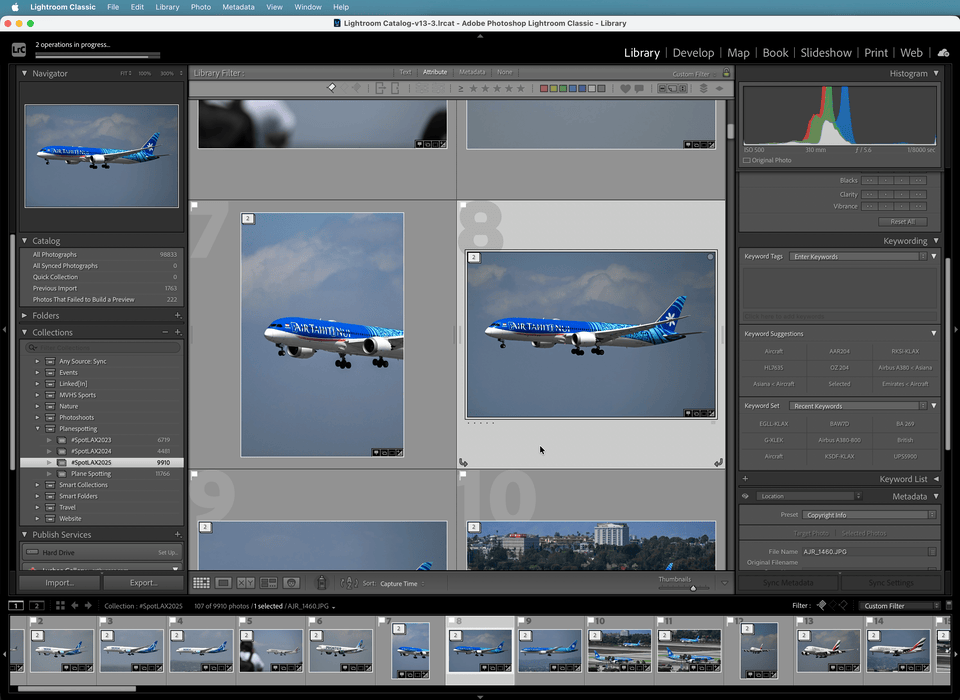

# PlaneSpotter Pal

A Lightroom Classic plugin that helps plane spotters identify aircraft in their photos using flight data from nearby airports.



## How It Works

1. **Select a photo** (or multiple) in Lightroom's Library module
2. Click **Library → Plug-in Extras → Identify Aircraft**
3. The plugin reads the photo's GPS coordinates and capture time
4. Finds the nearest airport(s) and queries arrivals/departures within a ±5 minute window
5. Shows a list of candidate flights with **Planespotters.net reference thumbnails**
6. Pick the correct aircraft → keywords are automatically added to your photo

## Supported Flight Data Providers

| Provider | Cost | Historical Depth |
|----------|------|-----------------|
| **AeroDataBox** (via RapidAPI) | Free tier: 600 calls/mo | ~365 days |
| **FlightAware AeroAPI** | ~$0.002/query | Back to 2011 |
| **FlightRadar24** | Subscription-based | Since June 2022 |

You only need an account with **one** provider. AeroDataBox is recommended for getting started (free tier available).

## Installation

1. Download or clone this repository
2. In Lightroom Classic, go to **File → Plug-in Manager**
3. Click **Add** and select the `planespotter-pal.lrdevplugin` folder
4. Click **Done**

## Setup

1. Go to **Library → Plug-in Extras → PlaneSpotter Pal Settings**
2. Select your flight data provider from the dropdown
3. Enter your API key for that provider
4. Adjust search radius (default: 5 nautical miles) and time window (default: ±5 minutes) if needed

### Getting API Keys

- **AeroDataBox**: Sign up at [RapidAPI](https://rapidapi.com/aedbx-aedbx/api/aerodatabox) — free tier available
      - **Note:** This is the one I've tested with and recommend so far. FlightAware and FR24 are untested.
- **FlightAware**: Register at [FlightAware AeroAPI](https://www.flightaware.com/aeroapi/portal)
- **FlightRadar24**: Subscribe at [FR24 API Portal](https://fr24api.flightradar24.com/) (requires plan with historical data access)

## Keywords Added

When you identify an aircraft, the plugin creates hierarchical keywords:

```
Aircraft
  └── Southwest Airlines
        └── B737-800
              └── N8541W
```

Plus flat keywords for searchability:
- Flight number (e.g., `WN1234`)
- Route (e.g., `KDEN-KLAX`)
- ICAO type code (e.g., `B738`)

## Requirements

- Lightroom Classic (SDK 12.0+)
- Photos must have **GPS coordinates** embedded (camera GPS or geotagged)
- Internet connection for API queries
- API key for at least one supported provider

## Photo Credits

Aircraft reference thumbnails are provided by [Planespotters.net](https://www.planespotters.net/) and credited to individual photographers per their terms of use.

## License

MIT
